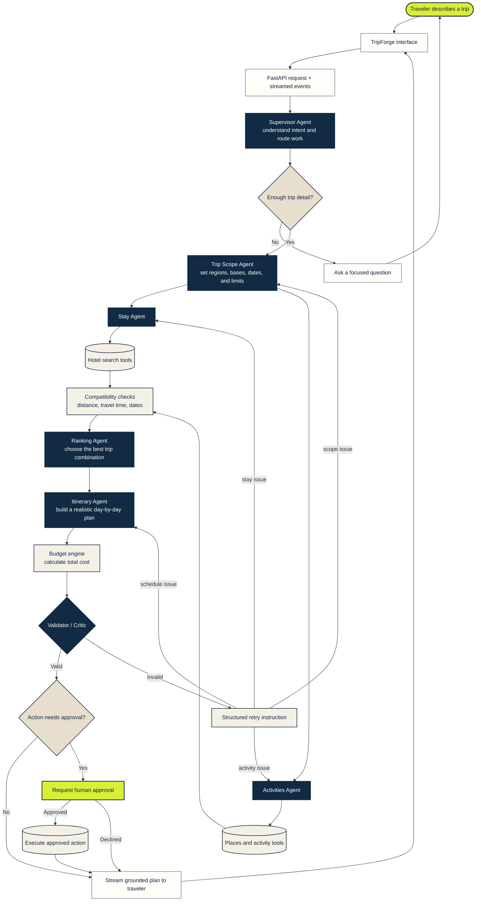

# Design System: TripForge

## Overview

**Creative North Star: "The Route Room"**

TripForge feels like a quiet contemporary wayfinding hall crossed with an active planning desk. It uses generous map-paper fields to make travel feel open and physical, then introduces softly elevated ink-blue planning objects when the product needs to prove coordination and rigor.

**Key Characteristics:**

- A light interface, never a dark-theme travel portal.
- Route diagrams, round status markers, and operational evidence rather than decorative travel imagery.
- Citron appears as a departure signal: rare, decisive, and reserved for forward motion.

## Agentic Flow

The planning experience follows a scoped, inspectable workflow. Agents make qualitative decisions, while tools and deterministic code handle external data, distance, timing, budget, and schema checks.

Stay and activity research fan out only after both receive the same geographic scope. Validation failures loop back to the smallest responsible step instead of restarting the entire workflow.

## Colors

Warm paper carries the page; blue creates structured planning zones; citron marks the one action that moves a trip forward.

### Primary

- **Departure Citron:** Used for primary actions, active route points, and live-state signals.

### Neutral

- **Route Ink:** Primary text, route lines, and precise navigation.
- **Wayfinding Blue:** Dense agent boards and validation sections.
- **Map Paper:** Default page surface and exploratory canvas.
- **Deep Map Paper:** Flat structural offset behind operational panels.
- **Quiet Slate:** Secondary explanatory copy and inactive labels.

**The Departure Signal Rule.** Citron is a stateful signal, not general decoration. Use it for one primary action or live waypoint at a time.

## Typography

**Display Font:** Geist Sans (with system sans fallback)

**Body Font:** Geist Sans (with system sans fallback)

**Label/Mono Font:** Geist Mono (with system mono fallback)

**Character:** Geist Sans keeps the product direct and current; compact mono labels make route status and planning metadata legible without turning the whole product technical.

### Hierarchy

- **Display:** Large, tightly tracked display language for landing-page statements.
- **Headline:** Strong section statements with the same compressed silhouette.
- **Title:** Small operational titles for agent and route-board elements.
- **Body:** Comfortable explanatory copy with a restrained measure.
- **Label:** Uppercase mono metadata for routes, status, and wayfinding.

**The Plain Language Rule.** Display copy should be clear enough to orient a traveler before it tries to persuade them.

## Layout

The desktop grid uses a broad two-part hero: travel intent and primary input on the left, operational proof on the right. Major sections use a maximum width of 1380px with 24px minimum side gutters. Desktop planning evidence is dense, followed by more spacious explanation and close. At 900px the hero and proof regions become single-column; at 600px detailed agent copy collapses before hierarchy does.

## Elevation & Depth

Depth is sparse and ambient. The route board and OTP handoff use broad diffuse shadows as distinct objects; quiet workflow tiles only lift on hover.

### Shadow Vocabulary

- **Route-board elevation:** `0 26px 60px rgba(16,38,60,.2)` for the primary planning object.
- **Auth dock:** `0 23px 70px rgba(16,38,60,.28)` only for the focused sign-in handoff.

## Shapes

The language is smooth and tactile: fields and actions use 14–18px corners, workflow tiles use 20–24px corners, and the primary route board uses a 30px corner. Circular markers carry status and progression; pills are reserved for compact labels and stops.

## Components

### Buttons

- **Shape:** Soft departure controls with 16–18px corners.
- **Primary:** Citron fill with ink text and a small upward hover lift.
- **Secondary:** Transparent or paper surfaces with a hairline border.
- **Focus:** 3px blue focus ring, offset from the control.

### Inputs / Fields

- **Style:** A large warm-white field with a 24px radius, one quiet slate border, and an inline route icon.
- **Focus:** The browser-visible focus ring must remain clear; never replace it with a low-contrast tint.
- **Error:** Use direct recovery copy below the input.

### Navigation

- **Style:** Minimal, text-first navigation with one compact pill for sign-in.
- **Mobile:** Hide secondary links and preserve the sign-in action.

### Route Board

- **Style:** A softly elevated blue operational surface with compact symbolic agent states, live status, a map-paper route canvas, and a dashed SVG path.
- **Motion:** Agent rows resolve once on entry; the route dash moves slowly and continuously when motion is permitted.

## Do's and Don'ts

### Do:

- **Do** use map-paper fields and actual route geometry to explain a trip.
- **Do** favor symbols, status dots, and visual pathways before explanatory copy.
- **Do** make route status and constraints visible in clear, compact mono labels.
- **Do** respect `prefers-reduced-motion`: preserve content while removing reveals and continuous movement.

### Don't:

- **Don't** use a dark page background, neon-glow AI panels, or generic booking-site image walls.
- **Don't** let rounded surfaces turn into a dense field of boxed cards.
- **Don't** scatter citron across a screen; it needs to retain departure significance.
- **Don't** present synthetic planning examples as real travel availability, pricing, or user proof.
