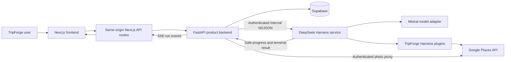
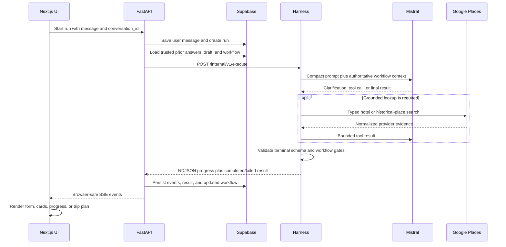

# TripForge Harness Architecture

Last updated: 2026-09-02

## 1. Purpose

TripForge uses DeepSeek Harness as a private agent runtime while preserving the
existing FastAPI backend as the public product API and Supabase as the durable
system of record.

The implementation deliberately combines two kinds of behavior:

- The language model understands multilingual, informal, incomplete travel
  requests and writes localized questions and answers.
- Deterministic application code owns workflow transitions, accepted schemas,
  tool evidence, authentication, persistence, retry limits, and browser-visible
  events.

This provides flexible conversation without allowing the model to arbitrarily
skip required planning stages or invent provider data.

## 2. Implemented system topology



### Why this topology

The browser does not call the Harness, Mistral, or Google provider directly.
That would expose provider credentials, weaken authorization, duplicate business
validation in the frontend, and couple the website to a developer-preview agent
runtime. FastAPI therefore remains the security and compatibility boundary.

The Harness is independently deployable because model orchestration has different
resource, timeout, scaling, and failure characteristics from the product API. It
can be replaced or upgraded without changing the browser contract.

## 3. Ownership boundaries

| Component | Owns | Why |
| --- | --- | --- |
| Next.js frontend | Conversation UI, dynamic forms, hotel cards, structured trip-plan rendering, safe progress timeline | Presentation can evolve without giving the browser credentials or workflow authority. |
| FastAPI backend | Authentication, ownership, public API, run lifecycle, SSE, output validation, error policy, persistence coordination | One trusted boundary protects all clients and keeps the frontend independent from Harness internals. |
| Supabase | Conversations, user/assistant messages, run records, events, clarification metadata, workflow state | Conversation continuity must survive process restarts and must not depend on local Harness files. |
| Harness service | Prompt execution, model/tool loop, bounded recovery, transient session context, structured terminal results | Agent-specific behavior stays isolated from product and database code. |
| Deterministic workflow controller | Goals, transitions, answered-question tracking, evidence gates, next action | Critical ordering and completeness should not depend only on probabilistic model behavior. |
| Provider plugins | Narrow, typed access to external data | Tool allowlisting prevents general browser, shell, or filesystem behavior. |

## 4. Request and response lifecycle



### How continuity works

Each submitted message creates a new `run_id` because a run represents one
execution attempt with its own status, events, retry behavior, and error history.
All those runs share a stable `conversation_id`.

Before a continuation starts, FastAPI reads trusted conversation data from
Supabase and reconstructs cumulative `answers`, `draft`, and `workflow` context.
The Harness receives a compact copy for that execution. Its local DSH session is
temporary and is not the source of truth.

### Why run and conversation IDs are separate

Reusing one run ID would make retries, failures, SSE replay, and audit history
ambiguous. A stable conversation ID provides continuity while a unique run ID
keeps every execution observable and idempotent.

## 5. Deterministic planning workflow

The versioned controller is implemented in `src/workflow.mjs`.

```text
request_understanding
        -> trip_requirements
        -> hotel_selection
        -> historical_places
        -> itinerary
        -> complete
```

Every goal has one of these statuses:

- `pending`
- `in_progress`
- `completed`
- `skipped`
- `blocked`

The controller calculates a single `next_action`:

| Goal | Required action |
| --- | --- |
| `request_understanding` | `classify_and_extract` |
| `trip_requirements` | `ask_only_missing_requirements` |
| `hotel_selection` | `ground_and_present_hotel_choices` |
| `historical_places` | `ground_historical_places` |
| `itinerary` | `compose_grounded_itinerary` |
| `complete` | `respond_to_follow_up` |

### How dynamic questions work

The system does not use a fixed English questionnaire. The model extracts facts
semantically from any supported language, dialect, transliteration, or natural
word order. It then asks only one to four questions that materially affect the
current result.

Application code records stable question IDs and recognizes bounded aliases such
as origin/departure or dates/date range. Before accepting clarification, it checks
the cumulative answers and draft. If every proposed question is already answered,
the terminal submission is rejected and the model is instructed to advance.

### Why the workflow is not prompt-only

A prompt can request good behavior but cannot guarantee it. Earlier iterations
could repeat questions, skip hotel cards, or draft an itinerary without the
required provider evidence. The reducer and terminal validator turn those product
requirements into enforceable invariants while leaving language understanding
and localized wording to the model.

## 6. Implemented Harness plugins

### `tripforge-persistent-headless`

File: `plugins/persistent-headless/index.mjs`

How it works:

- Replaces the stock Headless runner for production execution.
- Starts or resumes the private DSH session assigned to the conversation run.
- Flushes runtime events and consumes the structured terminal response.
- Performs one bounded recovery attempt when a turn finishes without a valid
  terminal result, including when a deterministic workflow rule rejected it.
- Exits successfully only when a valid TripForge terminal response exists.

Why it exists:

The standard CLI may stop after text output, a tool validation error, or a token
ceiling without producing the product schema. A single focused recovery attempt
improves reliability without creating an unbounded loop or silently accepting an
invalid answer.

### `tripforge-result`

File: `plugins/trip-result/index.mjs`

How it works:

- Registers the internal `submit_trip_response` terminal tool.
- Accepts only supported outcomes and bounded structured presentation fields.
- Enriches hotel choices from places observed in the same private session.
- Loads the workflow context supplied by the runtime.
- Checks repeated questions, hotel evidence, historical-place evidence, and
  premature itinerary generation.
- Stores a lossless JSON result and explicitly concludes the model turn.

Why it exists:

Free-form model text is difficult for the backend and frontend to validate and
render reliably. A terminal tool provides one typed exit from the agent loop and
places the final deterministic validation immediately before the response leaves
the Harness.

The tool is intentionally hidden from public activity counts because it is an
internal response mechanism, not a travel-data lookup meaningful to the user.

### `tripforge-progress`

File: `plugins/progress/index.mjs`

How it works:

- Observes DSH turn, step, model-chunk, and tool lifecycle events.
- Emits versioned `TRIPFORGE_PROGRESS` frames.
- Pairs public tool starts with completion/failure and duration.
- Throttles model activity updates and includes bounded latency/token metrics.
- Redacts secret-looking keys and limits object depth, list length, and strings.
- Never publishes raw reasoning deltas or the terminal submission tool.

Why it exists:

Users need feedback during a long planning run, but displaying private
chain-of-thought is unsafe and unstable. Safe phase summaries, goal status, tool
activity, and timing provide useful transparency without exposing hidden model
reasoning or credentials.

### `tripforge-google-places`

File: `plugins/google-places/index.mjs`

How it works:

- Registers the read-only `search_google_places` tool.
- Requires a typed `search_type` of `hotel` or `historical_place`.
- Calls only the fixed Google Places HTTPS endpoint.
- Uses bounded result counts, timeouts, cancellation, and an explicit field mask.
- Normalizes place IDs, names, addresses, coordinates, ratings, review counts,
  price levels, Maps URLs, and photo references.
- Records typed evidence by private session for terminal validation and hotel-card
  enrichment.

Why it exists:

The product currently supports grounded provider facts only for hotels and
historical places. A narrow typed tool reduces irrelevant calls, prompt size,
cost, security exposure, and hallucinated provider details. Stable Google place
IDs let the UI and later workflow turns refer to the same real property.

### `tripforge-google-routes`

File: `plugins/google-routes/index.mjs`

Current state: installed but disabled unless
`TRIPFORGE_GOOGLE_ROUTES_ENABLED=true`.

How it works when enabled:

- Registers the read-only `compute_google_route` tool.
- Requires grounded coordinates or provider identities.
- Returns normalized distance, duration, legs, optimized stop order, encoded
  polyline, and a Google Maps directions URL.
- Restricts network access to the fixed Google Routes endpoint.

Why it is disabled by default:

The Google Cloud project must explicitly enable and authorize Routes API. Keeping
the plugin installed behind a feature flag preserves the implementation without
causing failed route calls or making route availability a prerequisite for the
current hotel and historical-place workflow.

### Session place evidence helper

File: `plugins/shared/session-places.mjs`

This is shared plugin infrastructure rather than a Cordis plugin. It keeps a
bounded, in-memory index of places observed during the current private session,
separated into hotel and historical-place evidence. It also joins grounded hotel
metadata into `hotel_selection` options.

This prevents a model from attaching an unrelated image, rating, address, or Maps
URL to an invented hotel. The store is cleared after terminal submission and is
not used as durable conversation storage.

## 7. Harness composition and plugin policy

The active Cordis composition is built from:

- `config/tripforge.patch.yml` for the least-privilege base configuration.
- `src/plugin-patch.mjs` for portable local plugin URLs and environment-driven
  activation.
- `config/tripforge.inspector.patch.yml` only for the local developer Inspector.

The production composition retains the model/session core, safety boundaries,
timeouts, retries, compaction, and required plugin loader services. It disables
general coding-agent capabilities including shell, PowerShell, filesystem access,
generic web search, attachments, interactive DSH questions, skills, todos, goal
tools, telemetry, duplicate workflow systems, and browser UI services.

### Why least privilege is important

Trip planning does not require arbitrary command execution or filesystem access.
Removing those capabilities makes prompt injection less useful to an attacker,
reduces the model's tool-selection surface, lowers token usage, and produces a
more predictable travel product.

Unused plugins are disabled in the composition rather than deleting packages from
`node_modules`, because the DSH distribution owns its dependency graph while the
TripForge patch owns runtime activation.

## 8. Prompt architecture

Prompts are versioned outside JavaScript:

- `prompts/supervisor.md` defines scope, multilingual behavior, tool policy,
  workflow rules, grounding requirements, and concise response behavior.
- `prompts/headless-task.md` defines the per-request context and terminal schema.

The assistant supports only:

1. General travel guidance.
2. Hotel or historical-place search.
3. Full trip planning.

Other requests are denied briefly. The model classifies by meaning rather than
English keyword matching.

### Why prompts are separate files

Prompt changes are product-policy changes. Keeping them separate makes review,
testing, version control, and iteration easier and avoids mixing long natural
language instructions with process-management code.

## 9. Provider architecture

The current composition uses DSH's native `pi-ai` Mistral adapter with
`mistral-medium-3.5`. Provider credentials remain in `harness/.env`; new
deployments should use `MISTRAL_API_KEY`. The legacy `NVIDIA_API_KEY` environment
name remains accepted for the current local cutover.

The runtime config bounds:

- Reasoning effort.
- Context window.
- Maximum output tokens.
- Provider request and stream-idle timeouts.
- Provider retries.
- Overall Harness run time.
- Rate-limit cooldown.

### Why use the native adapter

The native adapter supports the provider's streaming and function-calling format
across tool-result turns. A generic OpenAI-compatible override previously caused
provider-specific incompatibilities. The bounded low-reasoning profile prioritizes
fast interactive clarification and reliably reaching the terminal tool.

## 10. FastAPI integration

FastAPI calls the Harness through `app/runtime/harness_http.py` using an internal
Bearer token and streams newline-delimited updates. The adapter:

- Converts Harness progress frames into the stable runtime abstraction.
- Accepts only known public event types and allowed data fields.
- Redacts secrets and bounds nested values again at the product boundary.
- Converts the terminal Harness result into the existing backend result state.
- Maps provider and runtime failures to user-safe messages.

`app/harness/runs.py` owns run creation, statuses, event sequencing, SSE replay,
heartbeats, terminal results, and Supabase persistence.

### Why validate twice

The Harness validates close to the model, and FastAPI validates again before data
is persisted or exposed publicly. This defense-in-depth approach prevents a plugin
or future Harness upgrade from accidentally widening the browser contract.

## 11. Supabase persistence

Workflow state is stored inside existing message `metadata` together with trusted
answers and draft facts. This first version does not require a SQL migration
because the existing JSON metadata column already supports the versioned object.

Supabase stores durable product history; raw DSH transcripts are created only in a
temporary per-run directory and removed after execution.

### Why not use Harness session files as the database

Local session files multiply during development, are tied to one machine/process,
contain runtime-specific details, and cannot safely enforce application ownership.
Supabase already provides the authenticated conversation boundary and is available
across backend and Harness restarts.

## 12. Frontend rendering

The frontend receives stable schemas rather than model-generated HTML.

- `ClarificationForm.tsx` renders dynamic text, textarea, number, location, date,
  date-range, boolean, select, multi-select, and grounded hotel-card controls.
- `PlanningProgress.tsx` renders compact safe workflow and tool activity.
- `TravelResponse.tsx` renders structured travel guidance.
- `TripPlanView.tsx` renders facts, daily sections, activities, notes, and grounded
  Maps links.
- `use-trip-planner.ts` manages runs, SSE updates, cumulative answers, workflow
  continuation, hydration, and selected hotels.

Hotel image URLs are generated server-side through an authenticated/same-origin
photo proxy. The frontend never receives a Google API key and does not need to
repeat the Places lookup.

### Why schema-driven UI is used

The model decides which questions are useful, while the website decides how each
approved question type looks and behaves. This keeps the UI flexible and
multilingual without allowing arbitrary model-generated components, scripts, or
unvalidated layouts.

## 13. Security and reliability controls

- Supabase authentication and conversation ownership remain in FastAPI.
- Harness HTTP is private and protected by a service Bearer token.
- Provider keys remain server-side.
- Tool endpoints use fixed HTTPS host allowlists.
- Inputs, outputs, list sizes, strings, and nesting are bounded.
- Unknown public activity events fail closed.
- Secret-looking event fields are redacted at Harness and backend boundaries.
- Tool calls support cancellation and explicit timeouts.
- Equivalent conversation executions are serialized to avoid session races.
- Provider `429` responses activate a cooldown instead of immediate retry storms.
- Overall runtime and output budgets prevent unbounded executions.
- The terminal controller rejects unsupported, repeated, ungrounded, or premature
  responses.

## 14. Implemented versus future architecture

Implemented now:

- One supervisor model loop with deterministic workflow control.
- Dynamic multilingual intake and follow-up questions.
- General travel, hotel/historical-place search, and full-trip modes.
- Grounded Google hotel cards and historical-place evidence.
- Structured clarification and presentation schemas.
- Supabase-backed conversation continuity.
- FastAPI-mediated SSE progress and error handling.
- Read-only Places tool and feature-flagged Routes tool.

Planned later:

- Specialized scope, stay, activity, transport, itinerary, budget, and validation
  agent presets where parallelism provides measurable value.
- A property-data plugin for live hotel offers, rooms, availability, reviews, and
  richer media.
- Optional weather, currency, timezone, and official travel-advisory plugins.
- Approval infrastructure before any booking or other consequential write action.
- Durable distributed run/event infrastructure before horizontally scaling the
  backend or Harness service.

### Why specialized agents were not added first

Multiple agents increase latency, token use, coordination failures, and debugging
complexity. The current priority is a reliable end-to-end product contract. Agent
specialization should be introduced only where it improves quality or parallel
research enough to justify that cost.

## 15. Verification strategy

The implementation is covered by:

- Harness unit and contract tests for workflow reduction, terminal validation,
  provider plugins, progress framing, recovery, Windows startup, and configuration.
- Backend tests for Harness parsing, schema validation, Supabase persistence, run
  management, safe progress allowlisting, and redaction.
- Frontend linting and schema-oriented components.

Live browser verification is intentionally performed separately by the project
owner because it requires local services, credentials, and visual interaction.

The current detailed completion ledger and verification counts are maintained in
`WORKFLOW_IMPLEMENTATION.md`.
